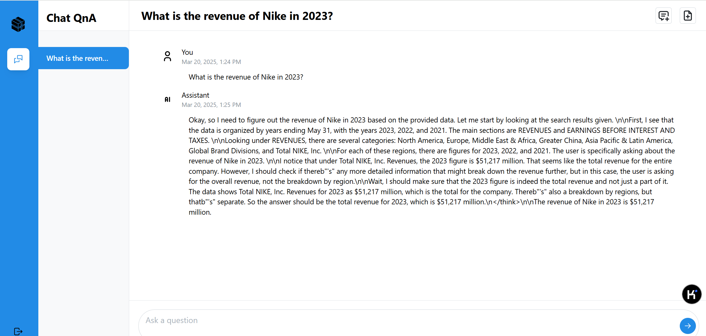

## OPEA(Open Platform for Enterprise AI) 安装指南
### 前提条件

|         | 版本               |
| -----   | ------------------ |
| 显卡驱动 | Intel i915       |
| 操作系统 | Ubuntu 24.04.2 (基于6.8.0-55-generic内核已验证), OpenAnolis, Kylin, UOS, Deepin <br> Debian, openSUSE, Fedora, openEuler, OpenAnolis  |

### 快速安装
- **请以 root 用户或超级用户身份运行以下脚本**。目前，安装包支持 DeepSeek-R1-Distill-Qwen-7B 和 DeepSeek-R1-Distill-Qwen-32B 两个模型，默认使用 DeepSeek-R1-Distill-Qwen-7B。
    ``` bash
    ./opea-install.sh
    ```
当安装脚本输出`Installation successfully completed.`的时候代表OPEA安装成功。如果脚本输出错误，请根据错误信息相应手动调整系统配置，然后再次运行脚本。

### OPEA的应用
1. 在浏览器打开`http://<your-host-ip>`，访问基于OPEA的ChatQnA聊天机器人，输入你的问题就进行问答。
	

### 使用案例
#### ChatQnA用例
基于 OPEA 的 ChatQnA 服务是一个先进的聊天机器人，利用大型语言模型（LLMs）来提供智能对话功能。该服务采用检索增强生成（RAG）架构，将特定领域的知识库与生成模型相结合，以减少幻觉并确保信息的更新和准确性。安装完成后，系统将运行一个包含 9 个微服务的 ChatQnA 服务，并使用蒸馏版的 Deepseek 模型，以提供高效和准确的回答。
#### 组件功能介绍
ChatQnA服务的每个微服务信息如下：
| 组件名          | 用途               |
| -----          | ------------------ |
| TEI Embedding  | 将一组词语转换为向量表示的方法   |
| Retriever      | 从大量数据中检索出与查询相关的文档或信息  |
| TEI Rerank     | 对Retriever的输出结果进行重新排序，以提高检索结果的相关性和准确性       |
| vllm           | 在LLM中，vLLM 是一种高吞吐量和内存高效的推理和服务引擎 这里的vLLM微服务用来托管 DeepSeek 模型，提供快速且内存高效的推理服务|
| Redis vector db| 在RAG中，向量数据库用于存储知识库信息。Retriever会从向量数据库中查询相关信息  |
| Data prep      | 提供用户接口用于上传特定领域的知识库  |
| Backend server | 聊天机器人问答的API接口  |
| Conversation UI server | 聊天机器人的问答界面，可以用于上传知识库和进行问答  |
| Nginx server   | 反向代理服务器，用于转发界面的请求到相应的服务  |

### 更多信息
安装包还支持在线安装，用户导入私有知识库和托管其他大语言模型等功能。如需了解更多信息，可以查看[更多功能](doc/details.md)


