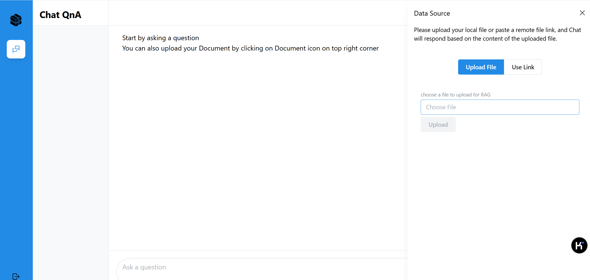

## 更多功能
### 安装目录
OPEA安装包的目录结构如下：    
opea-installer /    
├── doc/  
│── ├── details.md       
│── └── images/    
│──  ── ├── upload_icon.jpg        
│──  ── ├── upload.png    
│──  ── └── query.png    
├── README.md    
├── compose.yaml    
├── nke-10k-2023.pdf    
├── offline_packages_and_images_and_models_ubuntu24.04.tar.gz        
├── packages_ubuntu24.04.txt    
├── opea-install.sh    
└── setenv.sh    

| 文件名                                                       | 用途                            |
| --------------------------------------------------------- | ----------------------------- |
| compose.yaml                                              | docker-compose配置文件，用于创建OPEA服务 |
| nke-10k-2023.pdf                                          | 测试知识库                         |
| offline_packages_and_images_and_models_ubuntu24.04.tar.gz | 用于离线安装的LLM模型，容器镜像和依赖包         |
| setenv.sh                                                 | 安装脚本的启动参数                     |
| opea-install.sh                                           | 安装脚本                          |
### 安装
#### 非 root 用户安装
本脚本还允许非 root 用户以超级用户身份运行。如果当前用户不在 sudoer 组，可以运行如下命令将当前用户添加到 sudoer 组：    
``` bash
# 请用root或者超级用户执行此命令
sudo usermod -aG sudo <用户名>
```  
#### 在线安装
脚本还支持通过网络下载所有依赖，容器镜像和大模型。具体步骤如下：
- 下载安装包，在`setenv.sh`文件中配置脚本启动参数。关于如何申请Huggingface的token可以参考[Huggingface token申请步骤](#huggingface-token申请步骤)
``` bash
# 配置网络代理，脚本会自动为OPEA，apt和docker配置网络代理
export no_proxy=<your_no_proxy>
export https_proxy=<your_https_proxy>
export http_proxy=<your_http_proxy>
# 配置Huggingface token
export HF_TOKEN=<your_huggingface_token>
# 配置apt的国内源和dockerhub的国内镜像，如果不配置就用默认的
export DOCKERHUB_MIRROR=https://docker.mirrors.ustc.edu.cn
export APT_MIRROR=https://mirrors.tuna.tsinghua.edu.cn/ubuntu/
```
-  启动脚本， 输入`-m online`模式作为参数。
```
./opea-install.sh -m online
```

### 验证安装
1. 安装完成后，环境中有9个OPEA微服务，同通过如下命令可以检测每个微服务的运行状态。
    ```
    sudo docker ps --format "table {{.ID}}\t{{.Image}}\t{{.Status}}\t{{.Names}}"
    CONTAINER ID   IMAGE                                                   STATUS                         NAMES
    9d37f35fad4a   opea/nginx:1.2                                          Up About an hour               chatqna-xeon-nginx-server
    a96797abdd4b   opea/chatqna-conversation-ui:1.2                        Up About an hour               chatqna-xeon-conversation-ui-server
    86689de1f03a   opea/chatqna:1.2                                        Up About an hour               chatqna-xeon-backend-server
    9cb55b1ea5db   opea/dataprep:1.2                                       Up About an hour               dataprep-redis-server
    d07d1ccc3072   opea/retriever:1.2                                      Up About an hour               retriever-redis-server
    4f1cc713b924   intelanalytics/ipex-llm-serving-xpu:2.2.0-b14           Up About an hour               vllm-service
    56f2df7c54f0   ghcr.io/huggingface/text-embeddings-inference:cpu-1.5   Up About an hour               tei-embedding-server
    6eba1dd927fc   redis/redis-stack:7.2.0-v9                              Up About an hour               redis-vector-db
    0e07135e72fe   ghcr.io/huggingface/text-embeddings-inference:cpu-1.5   Up About an hour               tei-reranking-server
    ```
	如果有微服务不是`UP`的状态，可以用`docker logs -f <container_name>`查看日志并修正相应错误。
2. 故障排除
   - 检查每个微服务是否可用，参照[验证微服务](#验证微服务)
   - 如果所有微服务都正常工作，请检查端口`${host_ip}:8888`，该端口可能已被其他用户占用，您可以修改`compose.yaml`文件。
   - 如果你遇到类似 "The container name is in use" 的错误，请在 compose.yaml 文件中更改容器名称。

### 上传私有知识库
在浏览器打开`http://<your-host-ip>`，点击右上角的按钮，选择知识库。安装包里包含了一个测试知识库`nke-10k-2023.pdf`


### Huggingface token申请步骤
1. 登录 Hugging Face 账号： 如果你还没有账号，请先注册一个账号并完成邮箱验证。
2. 进入设置页面： 登录后，点击右上角的用户头像，在下拉菜单中选择“Settings”（设置）。
3. 访问 Access Tokens 选项卡： 在设置页面的左侧菜单中，点击“Access Tokens”（访问令牌）选项卡1。
4. 创建新令牌： 点击“New token”（新建令牌）按钮，输入令牌的名称（例如“my_api_key”），然后选择令牌的权限（读取、写入或管理）。
5. 生成令牌： 点击“Generate a token”（生成令牌）按钮，你将看到一个新的令牌。复制这个令牌并将其保存在一个安全的地方。

### 验证微服务
#### TEI Embedding服务
``` bash
curl ${host_ip}:8090/embed \
    -X POST \
    -d '{"inputs":"What is Deep Learning?"}' \
    -H 'Content-Type: application/json'
```
这会测试Embedding服务。它将“What is Deep Learning?”发送到Embedding服务，输出是句子的Embedding结果，是一个向量列表。例如：`[[0.00030903306,-0.06356524,0.0025720573,-0.012404448,0.050649878, ... , -0.02776986,-0.0246678,0.03999176,0.037477136,-0.006806653,0.02261455,-0.04570737,-0.033122733,0.022785513,0.0160026,-0.021343587,-0.029969815,-0.0049176104]]`
注意：向量维度由嵌入模型决定，输出值取决于模型和输入数据。

#### Retrieval 微服务
要使用Retrieval微服务，你需要通过Python脚本生成一个模拟嵌入向量。嵌入向量的长度由嵌入模型决定。这里我们使用模型`EMBEDDING_MODEL_ID="BAAI/bge-base-en-v1.5"`，模型维度是 768。
检查你的嵌入模型的向量维度，将`your_embedding`设置为与之相等。
``` bash
export your_embedding=$(python3 -c "import random; embedding = [random.uniform(-1, 1) for _ in range(768)]; print(embedding)")
curl http://${host_ip}:7000/v1/retrieval \
  -X POST \
  -d "{\"text\":\"test\",\"embedding\":${your_embedding}}" \
  -H 'Content-Type: application/json'
```
输出是与输入数据相关的检索到的文本：
``` bash
{
  "id": "27210945c7c6c054fa7355bdd4cde818",
  "retrieved_docs": [
    {
      "id": "0c1dd04b31ab87a5468d65f98e33a9f6",
      "text": "Company: Nike. financial instruments are subject to master netting arrangements that allow for the offset of assets and liabilities in the event of default or early termination of the contract.\nAny amounts of cash collateral received related to these instruments associated with the Company's credit-related contingent features are recorded in Cash and\nequivalents and Accrued liabilities, the latter of which would further offset against the Company's derivative asset balance. Any amounts of cash collateral posted related\nto these instruments associated with the Company's credit-related contingent features are recorded in Prepaid expenses and other current assets, which would further\noffset against the Company's derivative liability balance. Cash collateral received or posted related to the Company's credit-related contingent features is presented in the\nCash provided by operations component of the Consolidated Statements of Cash Flows. The Company does not recognize amounts of non-cash collateral received, such\nas securities, on the Consolidated Balance Sheets. For further information related to credit risk, refer to Note 12 — Risk Management and Derivatives.\n2023 FORM 10-K 68Table of Contents\nThe following tables present information about the Company's derivative assets and liabilities measured at fair value on a recurring basis and indicate the level in the fair\nvalue hierarchy in which the Company classifies the fair value measurement:\nMAY 31, 2023\nDERIVATIVE ASSETS\nDERIVATIVE LIABILITIES"
    },
    {
      "id": "1d742199fb1a86aa8c3f7bcd580d94af",
      "text": "..."
    }
  ]
}
```
#### TEI Rerank 微服务
``` bash 
curl http://${host_ip}:8808/rerank \
    -X POST \
    -d '{"query":"What is Deep Learning?", "texts": ["Deep Learning is not...", "Deep learning is..."]}' \
    -H 'Content-Type: application/json'
```
输出是：`[{"index":1,"score":0.9988041},{"index":0,"score":0.022948774}]`
它对输入进行评分。

#### vllm 服务
``` bash
curl http://${host_ip}:9009/v1/completions \
     -H "Content-Type: application/json" \
     -d '{"model": "/data/DeepSeek-R1-Distill-Qwen-7B",
          "prompt": "What is the revenue of Nike in 2023?",
          "max_tokens": 128
         }'
```
注意：启动 vllm 后，可能需要几分钟时间让 vllm 服务器加载 LLM 模型。

#### Dataprep 微服务
``` bash
curl http://${host_ip}:6007/v1/dataprep/ingest \
    -X POST \
    -F 'files=@./nke-10k-2023.pdf' \
    -F "chunk_size=500" \
    -H 'Content-Type: multipart/form-data'  
```
如果返回信息`{"detail":"Uploaded file nke-10k-2023.pdf already exists. Please change file name."}`说明文件已经上传过，无需再传。

#### Mega微服务
``` bash
curl http://${host_ip}:8888/v1/chatqna \
    -H "Content-Type: application/json" \
    -d '{
        "messages": "What is the revenue of Nike in 2023?" 
    }'
```
供您参考的输出如下:
``` bash
data: b'\n'

data: b'An'

data: b'swer'

data: b':'

data: b' In'

data: b' fiscal'

data: b' '

data: b'2'

data: b'0'

data: b'2'

data: b'3'

data: b','

data: b' N'

data: b'I'

data: b'KE'

data: b','

data: b' Inc'

data: b'.'

data: b' achieved'

data: b' record'

data: b' Rev'

data: b'en'

data: b'ues'

data: b' of'

data: b' $'

data: b'5'

data: b'1'

data: b'.'

data: b'2'

data: b' billion'

data: b'.'

data: b'</s>'

data: [DONE]
```
